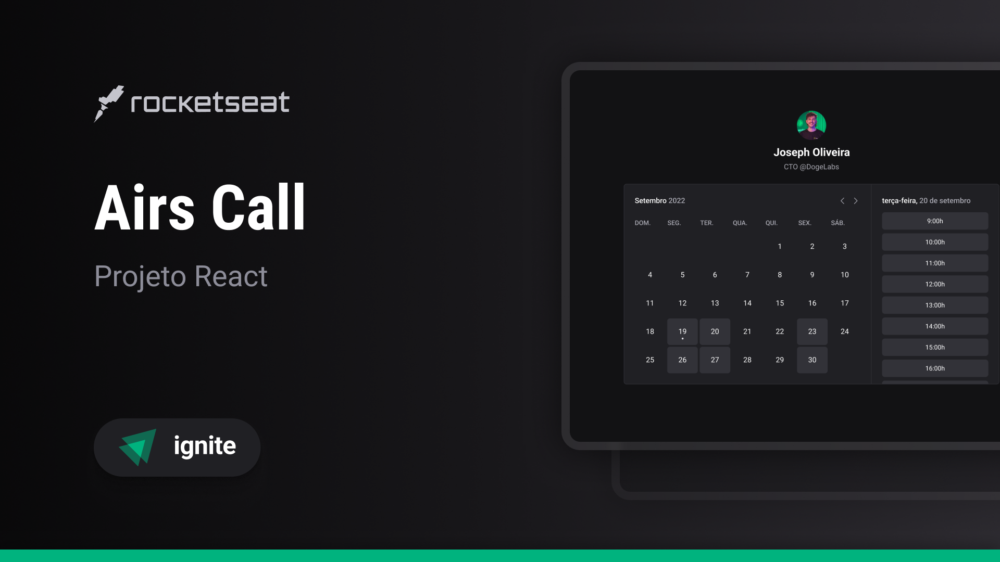

# 


## Airs Call
## 🎉 Sobre o projeto

Airs Call.

---

### 🛠️ Tecnologias

- [Typescript](https://www.typescriptlang.org/)


### 🔧 Instalação

1. Clone este repositório em sua máquina local:

```bash
$ git clone https://github.com/MauricioAires/airs-call
```

2. Na pasta raiz do projeto, instale as dependências:

```bash
  $ npm install
```

### ⚙️ Utilização

Para rodar a aplicação em modo de desenvolvimento, utilize o seguinte comando:

```bash
  $ npm run dev
```

Comando utilizado para rodar o Docker

```bash
  $ docker run --name mysql -e MYSQL_ROOT_PASSWORD=docker -p 3306:3306 mysql:latest
```

Comando utilizado para iniciar o container

```bash
  $ docker start mysql
```


Comando utilizado para parar o container

```bash
  $ docker stop mysql
```
Sincronizar o schema do Prisma executando todas as migrations

```bash
  $  npx prisma db push
```

### 🤝 Contribuição

Contribuições são bem-vindas! Para contribuir, basta abrir uma issue ou pull request neste repositório.

### 📝 Licença

Este projeto está sob a licença MIT.
Veja [LICENSE](LICENSE) para mais informações.

---

### 👨‍💻 Autor

Feito com 💙 by Mauricio Aires